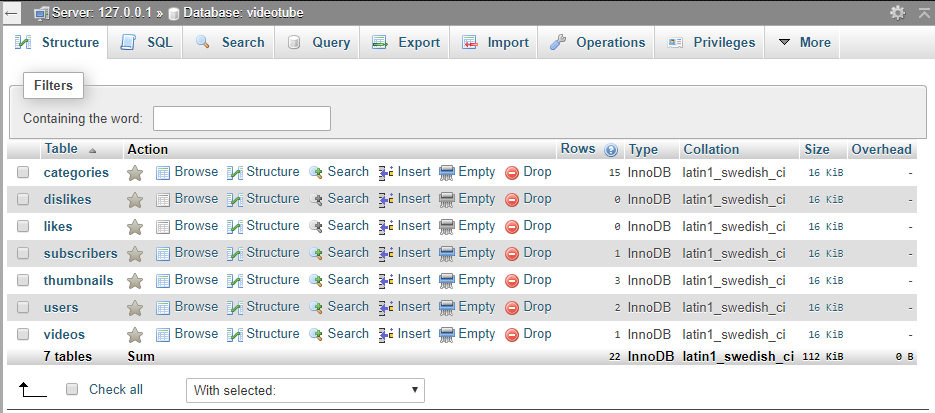

# WIP - VideoTube MySQL Project
*Making a YouTube-Like Website Using MySQL and JavaScript PHP*

## Contents
* Project Components
    1. Database Tables
        1. videotube
        2. categories
        3. users
        4. videos
        5. thumbnails
        6. subscribers
        7. likes
        8. dislikes 
    2. Website Pages
        1. index.php
        2. SignUp.php
        3. SignIn.php
        4. watch.php
    3. Database ER Diagrams
    4. References

## 1. Database Tables
**a. VideoTube**

The videotube database table is the main container for all of the other database tables.

Format: 